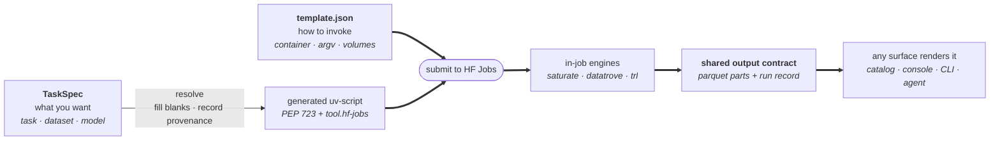
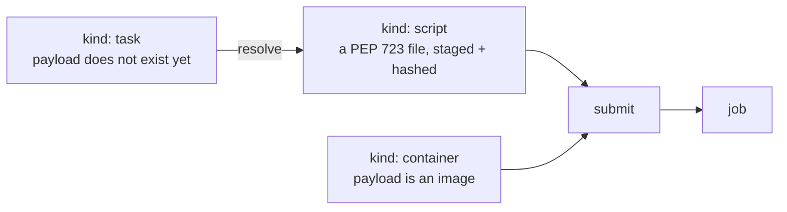

# How the Jobs pieces fit together

Two ways of describing "a runnable task on HF Jobs" appeared independently within a week:
[`template.json`](https://huggingface.co/spaces/chris-rannou/ocr-job-template) (Chris Rannou) and
`TaskSpec` (this repo). They look like competing specs. They aren't — and the
distinction is worth writing down, because it makes them compose rather than collide.

> **`template.json` describes _how to invoke_** — container, volumes, CLI flags.
> **`TaskSpec` describes _what you want_** — task, dataset, model.
> A **resolver** turns *what* into *how*. Everything ends in the same place.

## The picture



Two properties worth preserving whatever else changes:

- **every path ends in a runnable artifact on Jobs writing a known output shape** — which is what lets surfaces be added, duplicated or replaced harmlessly;
- **progress is read from storage, not from whoever launched the run** — so any UI can watch any run.

## What each is genuinely good at

| | `template.json` | `TaskSpec` |
|---|---|---|
| Payload | any container, any language | generates a Python uv-script |
| Parameters | typed, labelled, form-ready | semantic fields, resolver-fillable |
| Volumes | first-class (bucket/dataset, mount, ro/rw, positional) | not modelled — uses `hf://` URIs |
| Zero-config | defaults only | derived values + per-field provenance |
| Fan-out | one submit = one job | `world: N` = N sharded jobs, one run |
| Progress | job stage + logs | work-level, resumable, storage-read |
| Portability | Hub-coupled by design | ejected script runs anywhere |
| Extending | push a Space, add a catalog line | PR to the repo |

Neither is a superset. A container job (OCR with poppler + a rasteriser, TTS, game
assets) is *not expressible* in `TaskSpec`. Resolution and storage-backed resume are
*not expressible* declaratively — declarative defaults are constants; resolution is a
computation.

## Where they could converge

Not "one model replaces the other" — one **file format with a discriminator**, where the
shared half is the invocation half, and that half is already being standardised upstream
as the `tool.hf-jobs` PEP 723 header
([huggingface_hub#4558](https://github.com/huggingface/huggingface_hub/issues/4558) →
[#4598](https://github.com/huggingface/huggingface_hub/pull/4598)).



A submitting client only ever submits `script` or `container`. A `task` manifest is
explicitly *not self-sufficient* — it must be narrowed first. That's the honest crack in
the union, and naming it is what makes the design work.

Three moves, in order of how cheap and uncontroversial they are:

1. **A version field.** Neither format declares its own version today, so every future
   change is a silent breaking change. Cheapest possible fix; worth doing regardless of
   everything below.
2. **Make the job block exactly the `tool.hf-jobs` key set** (flavor, image, secrets, env,
   timeout, volumes, labels, timeout…). Today there are two vocabularies for the same ten
   concepts — `job.timeoutSeconds` in JSON vs `timeout` in TOML — which means two parsers,
   two docs pages, and an adapter for anything consuming both.
3. **Collapse `volumes` + `parameters` + `flavorChoices` into one `inputs` list**, where
   each input declares where its value *binds* — `argv`, `argv_positional`, `env`,
   `volume`, `job`, or `spec`. This is the actual unification: it lets the declarative
   form express booleans and secrets (neither is currently expressible), lets `flavor` be
   an ordinary enum input, and gives semantic fields a binding target so they can feed a
   resolver instead of an argv.

Resolution and fan-out stay **optional and explicitly provisional** — reserved in the
format, not designed to completion, because the Scripts repo type hasn't shipped and the
volume model is still moving.

### Sketch

```jsonc
{
  "spec": "hf-job/1",
  "name": "OCR dataset to markdown",
  "runtime": {
    "kind": "container",              // container | script | task
    "image": "hf.co/spaces/owner/ocr-job-template",
    "revision": "a1b2c3d",            // pin: without it, "re-run" is not reproducible
    "entrypoint": ["python", "/app/job.py"]
  },
  "job": { "flavor": "l4x1", "timeout": "30m", "secrets": [], "env": {} },
  "inputs": [
    { "id": "input", "label": "Input source", "type": "resource",
      "resource": { "kinds": ["bucket", "dataset"], "access": "read" },
      "bind": [ { "as": "volume", "mount": "/inputs", "readonly": true },
                { "as": "argv_positional", "position": 0, "value": "{mount}" } ] },

    { "id": "max_samples", "label": "Max samples", "type": "integer", "default": 10,
      "bind": { "as": "argv", "flag": "--max-samples" } },

    { "id": "overwrite", "label": "Overwrite existing", "type": "boolean", "default": false,
      "bind": { "as": "argv", "flag": "--overwrite", "style": "presence" } },

    { "id": "flavor", "label": "Hardware", "type": "enum",
      "choices": ["l4x1", "a10g-small", "a100-large"], "default": "l4x1",
      "bind": { "as": "job", "key": "flavor" } }
  ]
}
```

The semantic path uses the same file with `runtime.kind: "task"` and inputs that bind
`as: "spec"`; a resolver returns a narrowed `kind: "script"` manifest plus the values it
chose and where each came from (`user` / `curated` / `detected` / `default`), which is
what a UI renders as a "here's what we decided" panel before anything spends money.

## Open questions

- Does the parameter schema live *in* the artifact (a `tool.hf-jobs.params` table in the
  script header) or *beside* it (a separate manifest) — or both, by kind?
- Do curated tasks differ from community ones by anything other than a badge and a
  catalogue of tested models with receipts?
- Where do typed volumes belong in a single-file world?
- **What is the smallest thing worth agreeing first?** Argument for the output/run-record
  contract: parameters can diverge harmlessly for months, output shape can't — every UI,
  status command and downstream stage depends on it, and it's what lets someone render a
  run they didn't launch.
